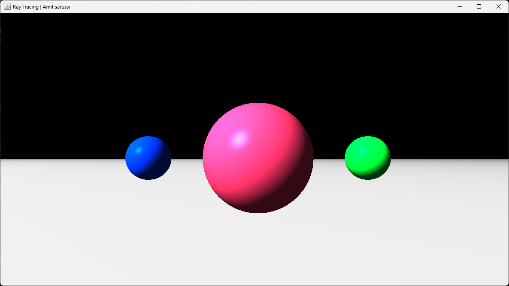

# Ray Tracing

A simple ray tracing project implemented in Java. This project demonstrates the fundamentals of ray tracing, including rendering spheres, handling reflections, and basic lighting.
All math and logic in this project were implemented from scratch without using any external libraries.

## Features

- Ray-sphere intersection
- Diffuse and specular lighting
- Shadows
- Reflections
- Configurable scene setup

## Usage

- Configure the scene by editing the source code (add spheres, lights, etc.).
- Output images are saved to the project directory.

## Example Output

